# Domain Driven Desing (DDD) for developers
[TOC]
## Introduction
There is a lot of information about DDD, but I can not find a short information what is the difference from Object-Oriented Analysis and Design (OOAD) and what changes developers could expect. So I try to extract and collect only small piece from big mountain where is software developers quickly understood the difference from most popular way of software development.

## When DDD might be useful
There is no big point in using DDD if you have a small project or don't have a big problem in the current project.
There are advantages and disadvantages to every design approach. We are trying to discover a few of them.
The same things are seen in different ways depending on who is looking at them.
When a domain expert sees the room:
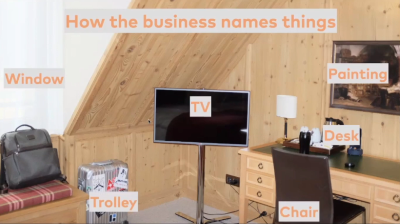
*Pic 1. Business names. (© Michael Plöd)*

When a developer sees the same space:
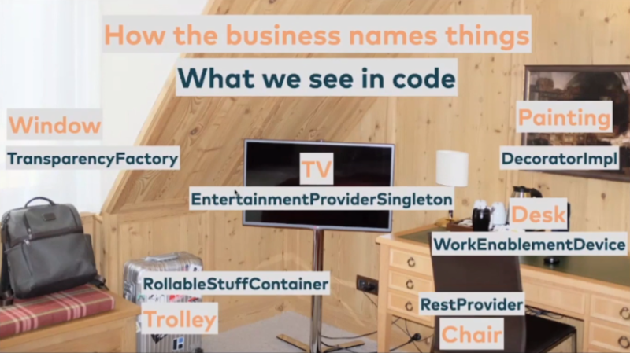
*Pic 2. Naming in Software Code. (© Michael Plöd)*
Can you see? Both people cannot work well together, they use different language for the same objects.
Would it not be better if we spoke a common language?

The next example. Do you remember a similar structure in your project?  
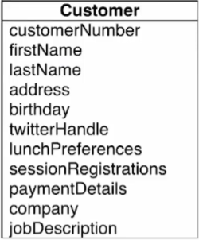  
*Pic 3. Common object. (© Michael Plöd)*
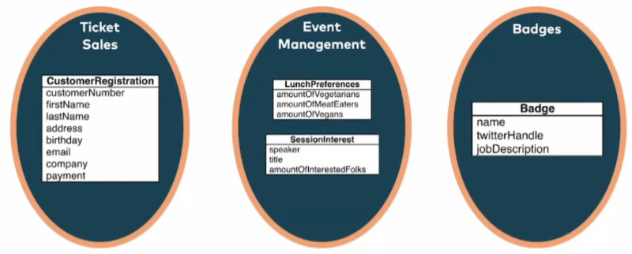  
*Pic 4. Division according to business areas. (© Michael Plöd)*  
Which objects would you like?

## Two ways of thinking

1. Our application is a collection of objects. Every object has attributes and methods - operations. Objects and data flow are our main guides.
Do you remember class inheritance and how every object can run?
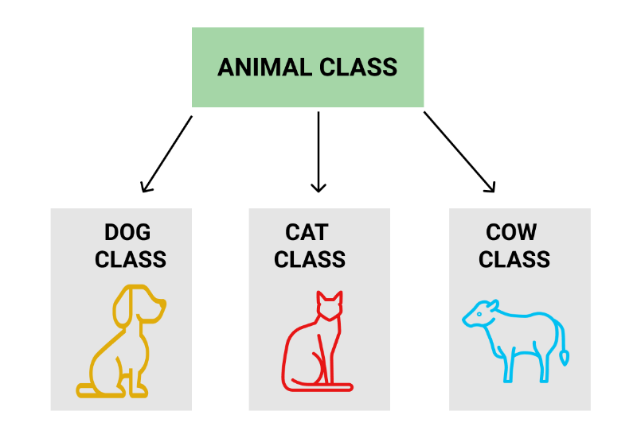  
*Pic 5. Class inheritance. (© libretexts.org)*
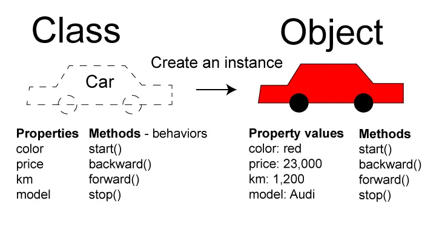  
*Pic 6. Class definition and implementation. (© aigents.co)*
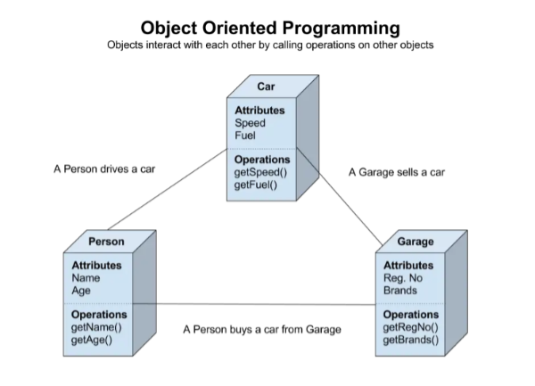  
*Pic 7. OOP example. (© www.iameans.top)*  
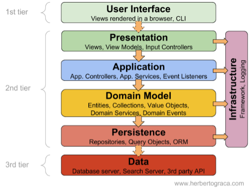  
*Pic 8. OOP Layers. (© www.iameans.top)*  
2. Our application follow our buisness rules. A person start an action, we check some rules and finish the action.
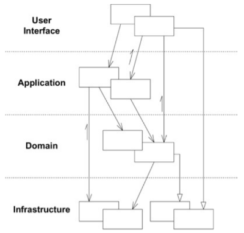  
*Pic 9. DDD Layers 2003.(© Eric Evans)*  
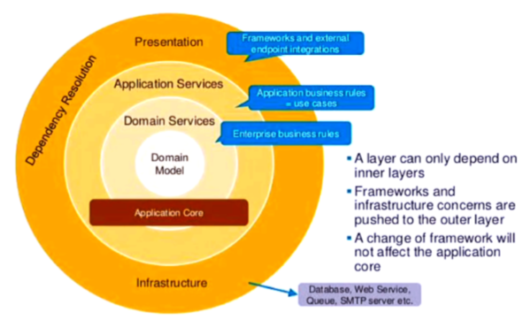  
*Pic 10. Onion Architecture.(© Constantin Gustov)*  
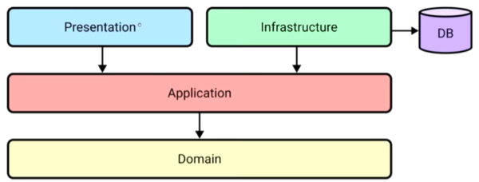  
*Pic 11. Onion Architecture different view.(© Amichai Mantinband)*  

## DDD vocabulary
I want to save your time and copy some definitions from book5.
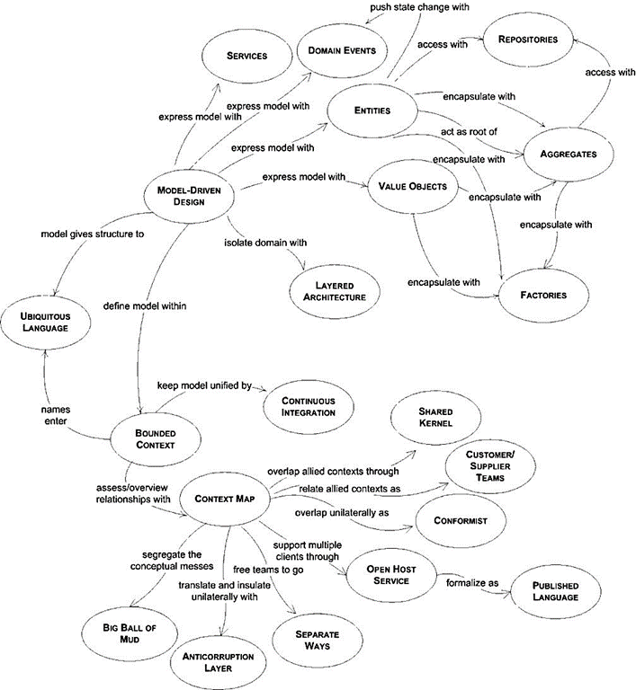  
*Pic 12. Pattern Language Overview.(© Eric Evans)*

- **Domain**. A sphere of knowledge, influence, or activity. The subject area to which the user applies a program is the domain of the software.
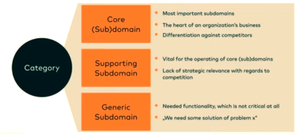 *© Michael Plöd*

- **Model** A system of abstractions that describes selected aspects of a domain and can be used to solve problems related to that domain.

- **Ubiquitous language** A language structured around the domain model and used by all team members within a bounded context to connect all the activities of the team with the software.

- **Context** The setting in which a word or statement appears that determines its meaning. Statements about a model can only be understood in a context.
- **Bounded context** A description of a boundary (typically a subsystem, or the work of a particular team) within which a particular model is defined and applicable.

- **Entities** Many objects represent a thread of continuity and identity, going through a lifecycle, though their attributes may change. An object must be distinguished from other objects even though they might have the same attributes. Mistaken identity can lead to data corruption.

- **Value Objects** Some objects describe or compute some characteristic of a thing. Many objects have no conceptual identity. When you care only about the attributes and logic of an element of the model, classify it as a value object. Treat the value object as immutable. 

- **Domain Events** Something happened that domain experts care about. A domain event is a full‐fledged part of the domain model, a representation of something that happened in the domain. Domain events are ordinarily immutable, as they are a record of something in the past. A domain event often has a separate timestamp indicating when the event was entered into the system and the identity of the person who entered it.

- **Services** When a significant process or transformation in the domain is not a natural responsibility of an entity or value object, add an operation to the model as a standalone interface declared as a service. Define a service contract, a set of assertions about interactions with the service.

- **Modules** Choose modules that tell the story of the system and contain a cohesive set of concepts. Give the modules names that become part of the ubiquitous language. Modules are part of the model and their names should reflect insight into the domain.  
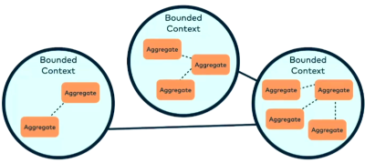 *© Michael Plöd*

- **Aggregates** Cluster the entities and value objects into aggregates and define boundaries around each. Choose one entity to be the root of each aggregate, and allow external objects to hold references to the root only (references to internal members passed out for use within a single operation only). Define properties and invariants for the aggregate as a whole and give enforcement responsibility to the root or some designated framework mechanism.  
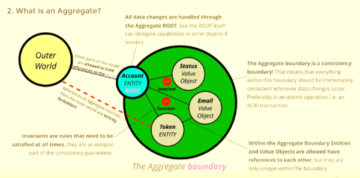 *© Thomas Ploch*

- **Repositories** Query access to aggregates expressed in the ubiquitous language. For each type of aggregate that needs global access, create a service that can provide the illusion of an in-memory collection of all objects of that aggregate’s root type. Set up access through a wellknown global interface. Provide methods to add and remove objects, which will encapsulate the actual insertion or removal of data in the data store. 

## How to model business processes

Event storming is the most popular process modelling. The idea is to bring together software developers and domain experts and let them learn from each other. The result is based on repetitive actions taken from the real world.
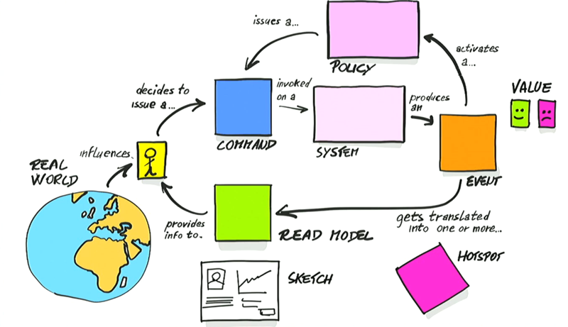
*Pic 13. Introducing EventStorming.(© Alberto Brandolini)*
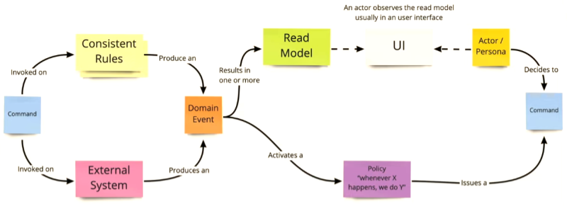
*Pic 14. Design Level EventStorming (© Michael Plöd)*
Here is an example of a possible result:
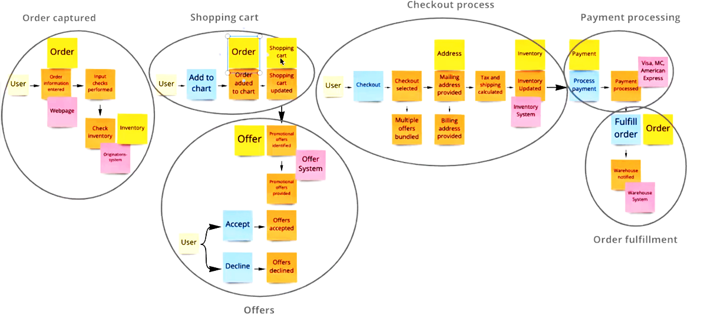
*Pic 15. Event Storming by Judith birmoser.(© Judith Birmoser)*
> **Note**: Inside the ellipses is a bounded context

## Application example
You can find description **[here](example.md)**

## Learn more

I don't want to tell you - these are the best links. These are just some links to start with.

### Books
> **Note**: Reading order is important - 1, 2, 3.

1. Vaughn Vernon [Domain-Driven Design Distilled](https://www.amazon.com/Domain-Driven-Design-Distilled-Vaughn-Vernon-ebook/dp/B01JJSGE5S) (about 160 pages)  
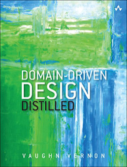  

2. Vaughn Vernon [Implementing Domain-Driven Design](https://www.amazon.com/Implementing-Domain-Driven-Design-Vaughn-Vernon/dp/0321834577) (about 700 pages)  
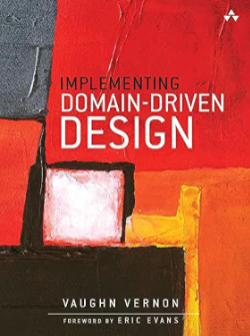  

3. Eric Evanc [Domain-Driven Design](https://www.amazon.com/dp/0321125215/ref=wl_it_dp_o_pC_nS_ttl?_encoding=UTF8&colid=CG11VVP0H8Y8&coliid=I1X0NXLUHTFGE4) (about 450 pages)  
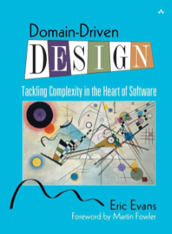  

4. Alberto Brandolini [Introducing EventStorming](https://leanpub.com/introducing_eventstorming)  
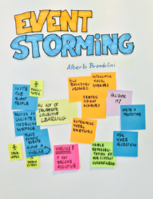  

5. Eric Evans [DDD Reference](https://www.domainlanguage.com/ddd/reference/) Free PDF.

### Videos

- Eric Evans [What is DDD - DDD Europe 2019](https://www.youtube.com/watch?v=pMuiVlnGqjk)  

- Eric Evans [Bounded Contexts - DDD Europe 2020](https://www.youtube.com/watch?v=am-HXycfalo)  

- Vaughn Vernon [Microservices and Domain Driven Design (Munich 2017)](https://www.youtube.com/watch?v=3o4_FWk6JOQ)  

- Vaughn Vernon [How to Use Aggregates for Tactical Design](https://www.youtube.com/watch?v=Xf_aLAK1RfE)  
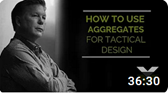

- Alberto Brandolini [Event Storming - DDD Europe 2019](https://www.youtube.com/watch?v=mLXQIYEwK24)  
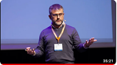

- Michael Plöd [Introduction to Context Mapping - DDD Europe 2022](https://www.youtube.com/watch?v=k5i4sP9q2Lk)  
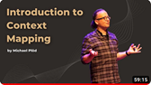

- Amichai Mantinband [ASP.NET 6 REST API Following CLEAN ARCHITECTURE & DDD Tutorial (19 parts)](https://www.youtube.com/watch?v=fhM0V2N1GpY&list=PLzYkqgWkHPKBcDIP5gzLfASkQyTdy0t4k)  
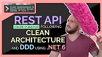

### Websites
- [Domain-Driven Design Crew](https://github.com/ddd-crew)
- [Free Domain-Driven Design Learning Resources](https://github.com/ddd-crew/free-ddd-learning-resources)
- [Event Storming](https://www.eventstorming.com/)
- [Design Level Event Storming with examples](https://mrpicky.dev/design-level-event-storming-with-examples/)
- [github - Domain Driven Design (DDD) N-LayeredArchitecture with .Net Core](https://github.com/cesarcastrocuba/nlayerappv3)
- [github - An Event Sourcing service template with DDD, TDD and SOLID](https://github.com/ivanpaulovich/event-sourcing-castanha)
