[TOC]


## Application example
The most interesting question to ask is - what will my DDD application look like?
I am trying to use the [example](https://github.com/AlexNek/buber-dinner) that is described in detail by [Amichai Mantinband](https://www.youtube.com/watch?v=fhM0V2N1GpY&list=PLzYkqgWkHPKBcDIP5gzLfASkQyTdy0t4k)  
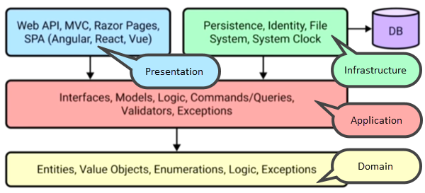  
*Pic. DDD suggested application architecture.(© Amichai Mantinband)*

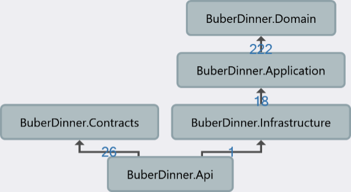  
*Pic. Example application project dependencies.*
> **Note**: This is just an example, not an implementation guide.

### Points to look out for
- Domain project: all classes are immutable, no public setters.
- The interfaces are defined in the application project, but are implemented in the infrastructure project.
- We can split commands/queries and their handlers using the mediatR library.

### Domain project
By default, domain project include parts of bounded contexts such as aggregates. Pay attention, they are immutable.
It is very important in the world of DDD that objects don't have a public setter.  
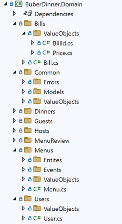  
*Pic. Sample application domain project.*

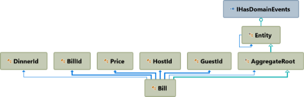  
*Pic. Bill aggregate.*

```csharp
public sealed class Bill : AggregateRoot<BillId, Guid>
{
    public DinnerId DinnerId { get; }
    public GuestId GuestId { get; }
    ...

    private Bill(BillId id, GuestId guestId, HostId hostId, Price price, DateTime createdDateTime, DateTime updatedDateTime)
        : base(id)
    {
...
    }

    public static Bill Create(GuestId guestId, HostId hostId, Price price)
    {
        return new(BillId.CreateUnique(), guestId, hostId, price, DateTime.UtcNow, DateTime.UtcNow);
    }

    private Bill() { }
}
```

```csharp
public sealed class DinnerId : AggregateRootId<Guid>
{
    public override Guid Value { get; protected set; }

    private DinnerId(Guid value)
    {
        Value = value;
    }

    public static DinnerId CreateUnique()
    {
        return new DinnerId(Guid.NewGuid());
    }

    public static DinnerId Create(Guid value)
    {
        return new(value);
    }

    public override IEnumerable<object> GetEqualityComponents()
    {
        yield return Value;
    }

    private DinnerId() { }
}
```

### Application project
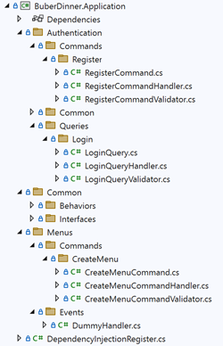  
*Pic. Sample application application project.*

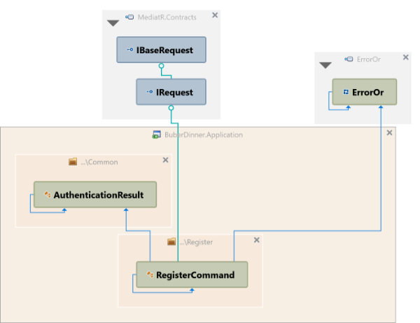

```csharp
public record RegisterCommand(
    string FirstName,
    string LastName,
    string Email,
    string Password) : IRequest<ErrorOr<AuthenticationResult>>;
```
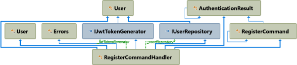

```csharp
public class RegisterCommandHandler :
    IRequestHandler<RegisterCommand, ErrorOr<AuthenticationResult>>
{
    private readonly IJwtTokenGenerator _jwtTokenGenerator;
    private readonly IUserRepository _userRepository;

    public RegisterCommandHandler(IJwtTokenGenerator jwtTokenGenerator, IUserRepository userRepository)
    {
        _jwtTokenGenerator = jwtTokenGenerator;
        _userRepository = userRepository;
    }

    public async Task<ErrorOr<AuthenticationResult>> Handle(RegisterCommand command, CancellationToken cancellationToken)
    {
        await Task.CompletedTask;

        if (_userRepository.GetUserByEmail(command.Email) is not null)
        {
            return Errors.User.DuplicateEmail;
        }

        var user = User.Create(command.FirstName, command.LastName, command.Email, command.Password);

        _userRepository.Add(user);

        var token = _jwtTokenGenerator.GenerateToken(user);

        return new AuthenticationResult(user, token);
    }
}
```

### Infrastructure project
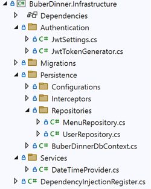  
*Pic. Sample application infrastructure project.*
```csharp
public sealed class MenuRepository : IMenuRepository
{
    private readonly BuberDinnerDbContext _dbContext;

    public MenuRepository(BuberDinnerDbContext dbContext)
    {
        _dbContext = dbContext;
    }

    public void Add(Menu menu)
    {
        _dbContext.Add(menu);
        _dbContext.SaveChanges();
    }
}
```
### Contracts project
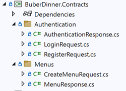  
*Pic. Sample application contracts project.*

```csharp
public record CreateMenuRequest(
    string Name,
    string Description,
    List<MenuSection> Sections);

public record MenuSection(
    string Name,
    string Description,
    List<MenuItem> Items);

public record MenuItem(
    string Name,
    string Description);
```
```csharp
public record MenuResponse(
    string Id,
    string Name,
    string Description,
    float? AverageRating,
    List<MenuSectionResponse> Sections,
    string HostId,
    List<string> DinnerIds,
    List<string> MenuReviewIds,
    DateTime CreatedDateTime,
    DateTime UpdatedDateTime);

public record MenuSectionResponse(
    string Id,
    string Name,
    string Description,
    List<MenuItemResponse> Items);

public record MenuItemResponse(
    string Id,
    string Name,
    string Description);
```
### API project
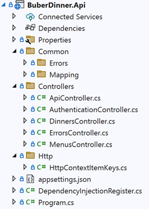  
*Pic. Sample application API project.*
```csharp
[Route("hosts/{hostId}/menus")]
public class MenusController : ApiController
{
    private readonly IMapper _mapper;
    private readonly ISender _mediator;

    public MenusController(IMapper mapper, ISender mediator)
    {
        _mapper = mapper;
        _mediator = mediator;
    }

    [HttpPost]
    public async Task<IActionResult> CreateMenu(
        CreateMenuRequest request,
        Guid hostId)
    {
        var command = _mapper.Map<CreateMenuCommand>((request, hostId));

        var createMenuResult = await _mediator.Send(command);
        return createMenuResult.Match(
            menu => Ok(_mapper.Map<MenuResponse>(menu)),
            errors => Problem(errors));
    }
}
```
## Sequence diagrams
On the sequence diagram you can see the request/response flow.
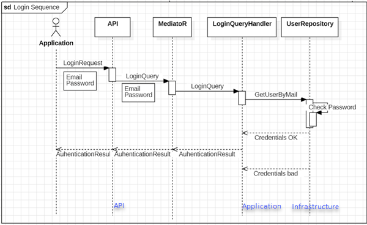  
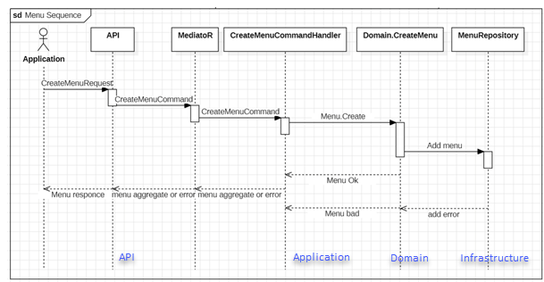